# QuieTeX
[](https://pypi.org/project/quietex)
[](https://pypi.org/project/quietex)

Take your LaTeX builds from this:

to this:


<!--
Build animations with:
termtosvg building-without-quietex.svg --command="latexmk chapters/background/background.tex" -t window_frame -g 80x15 -M 200 -D 2000
-->

QuieTeX is a minimal command-line tool which filters and colourizes the output of `pdflatex` in real-time.
It is not a build tool, it does not do any clever summaries, it just makes it easier to read.


## Features
* Hides open/close file logging
* Colours errors red
* Colours warnings yellow
* TeX input prompt works in `errorstopmode` and `scrollmode`
* `latexmk` integration


## Usage
To install:
```bash
pip3 install quietex
```

To use:
```bash
quietex pdflatex test.tex
```

To use with `latexmk`, add this to your `latexmkrc`:
```perl
# Make output prettier
eval `quietex --latexmkrc`;
```


## Development
To install in editable mode:
```bash
pip3 install -e .
```

Use [pre-commit](https://pre-commit.com) to check and format changes before committing:
```bash
pip install pre-commit
pre-commit install
```


## Misc
TODO:
* Add tests
* Add example before/after to readme
* Show open-files stack before warnings and errors
* Display page numbers in real-time, before the end of the line
* Completions for TeX prompt
* Syntax highlighting for TeX snippets
* Configurable styles
* Verbose mode, note about dim on macOS
* Collapse multiple blank lines, maybe remove all blank lines between single-line warnings
* Recognise multi-line warnings with (package name) continuations
* Highlight "Output written on" message

The approach for colouring `latexmk` messages is inspired by [this Stack Overflow answer](https://tex.stackexchange.com/a/406370).
The way I've packaged `latexmkrc` is taken straight from [mje-nz/pythontexfigures](https://github.com/mje-nz/pythontexfigure), my library for generating good-looking figures by integrating Python scripts into LaTeX documents.
